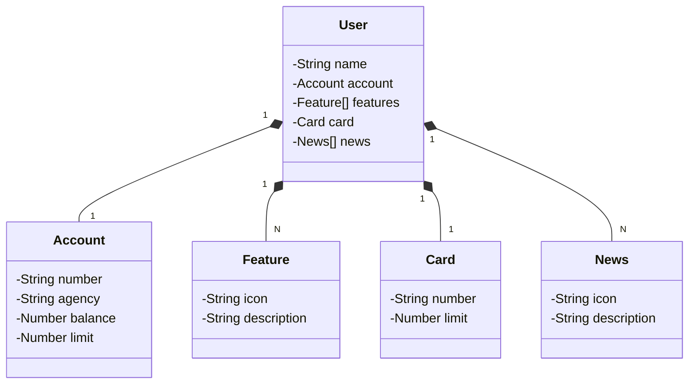

# RESTful API para o Santander Mobile App

Java RESTful API criada para a Santander Dev Week, parte do curso 
Publicando Sua API REST na Nuvem Usando Spring Boot 3, Java 17 e Railway da [DIO](https://dio.me/).

## Principais Tecnologias
 - **Java 21**: Utilizada a versão 21 LTS do Java para tirar vantagem das últimas inovações que essa linguagem robusta e amplamente utilizada oferece;
 - **Spring Boot 3**: Spring Boot maximiza a produtividade do desenvolvedor por meio de sua poderosa premissa de autoconfiguração;
 - **Spring Data JPA**: Simplifica a camada de acesso aos dados, facilitando a integração com bancos de dados SQL;
 - **OpenAPI (Swagger)**: Documentação de API eficaz e fácil de entender usando a OpenAPI (Swagger), perfeitamente alinhada com a alta produtividade que o Spring Boot oferece;
 - **Railway**: facilita o deploy e monitoramento de nossas soluções na nuvem, além de oferecer diversos bancos de dados como serviço e pipelines de CI/CD.

## [Link do Figma](https://www.figma.com/file/0ZsjwjsYlYd3timxqMWlbj/SANTANDER---Projeto-Web%2FMobile?type=design&node-id=1421%3A432&mode=design&t=6dPQuerScEQH0zAn-1)

O Figma foi utilizado para a abstração do domínio desta API, sendo útil na análise e projeto da solução.

## Diagrama de Classes (Domínio da API)



## Rodar no VSCode

adicionar ao launcher.json
```json
{
    // Use IntelliSense to learn about possible attributes.
    // Hover to view descriptions of existing attributes.
    // For more information, visit: https://go.microsoft.com/fwlink/?linkid=830387
    "version": "0.2.0",
    "configurations": [
        {
            "type": "java",
            "name": "Current File",
            "request": "launch",
            "mainClass": "${file}"
        },
        {
            "type": "java",
            "name": "SantanderDevWeek2023Application",
            "request": "launch",
            "mainClass": "me.dio.santanderdevweek2023.SantanderDevWeek2023Application",
            "projectName": "santander-dev-week-2023",
            "args": "--spring.profiles.active=dev"
        }
    ]
}
```